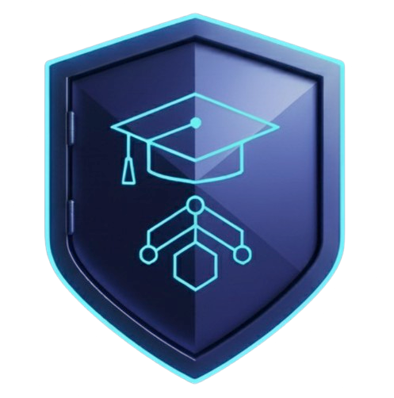
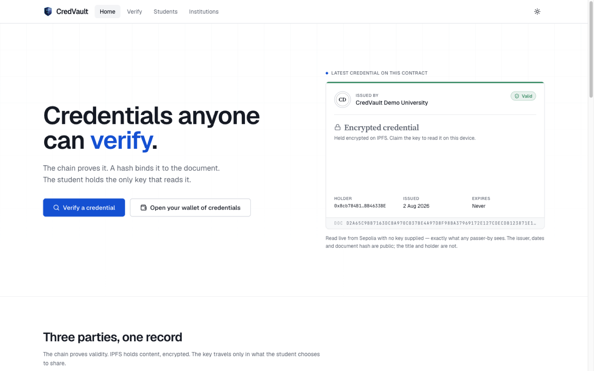
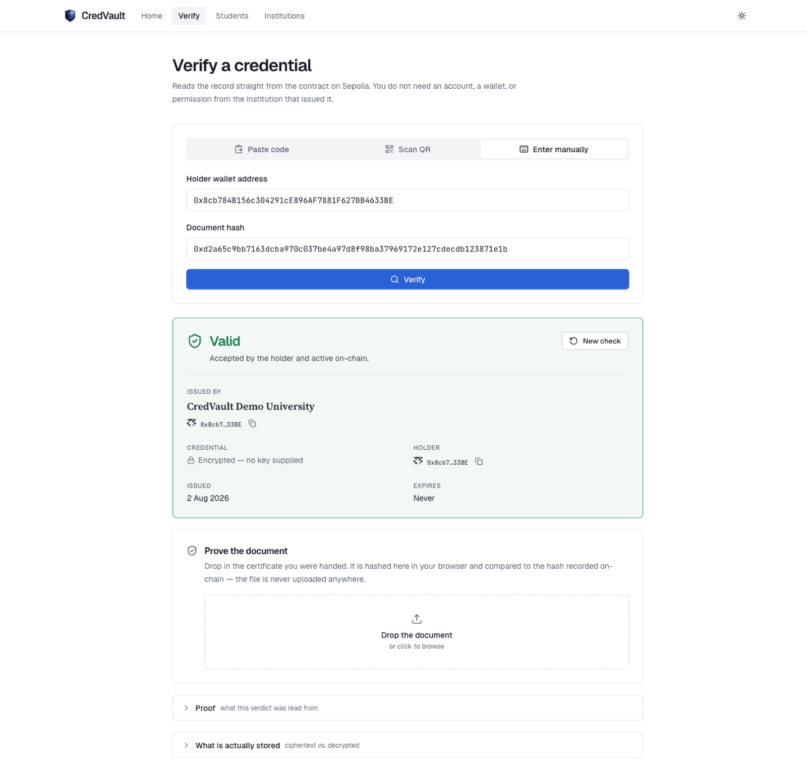
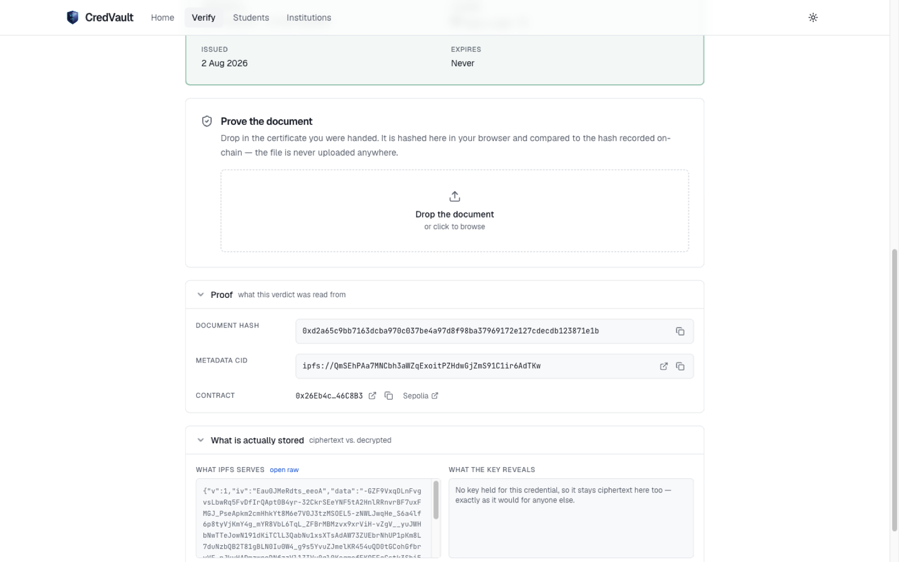
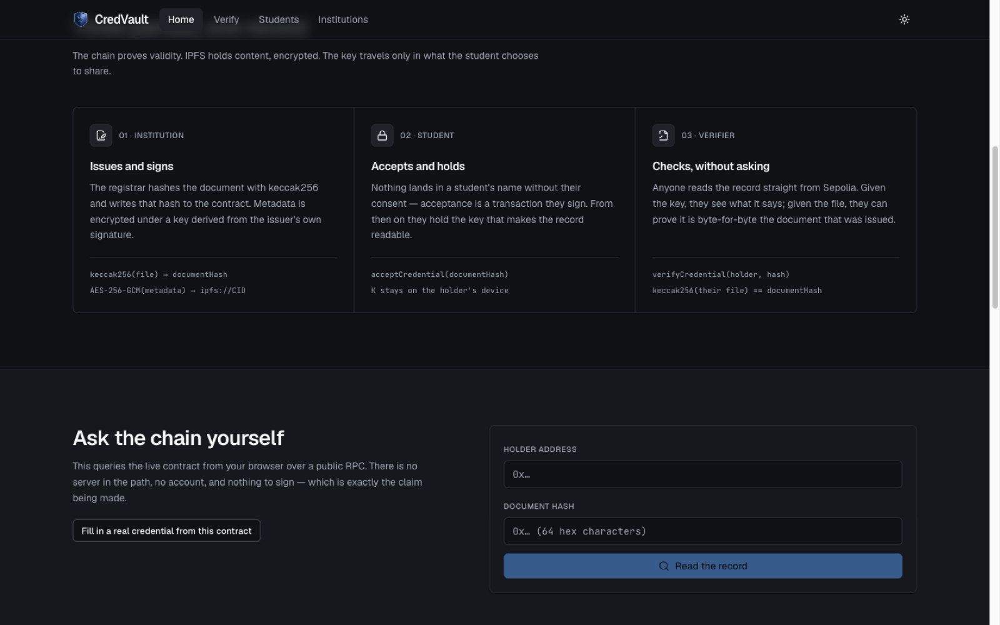

<div align="center">



# CredVault

**Verifiable academic credentials on Ethereum.**

The chain proves the credential. A `keccak256` hash binds it to the document.<br />
The student holds the only key that reads it.

[](https://github.com/rkhooda/CredVault/actions/workflows/ci.yml)
[](Backend-Contracts/README.md)
[](https://sepolia.etherscan.io/address/0x26Eb4c3f71ab6735e6c4b5a04D88fa902c46C8B3)
[](https://repo.sourcify.dev/11155111/0x26Eb4c3f71ab6735e6c4b5a04D88fa902c46C8B3)
[](LICENSE)

**[Live demo](https://cred-vaulte.vercel.app)**  ·  [Try it end to end](docs/CredVault-Testing-Walkthrough.pdf)  ·  [Contract on Etherscan](https://sepolia.etherscan.io/address/0x26Eb4c3f71ab6735e6c4b5a04D88fa902c46C8B3)  ·  [Architecture & threat model](Backend-Contracts/README.md)

</div>

---

<!--
  Demo recording: drop a screen capture at docs/demo.gif (or upload an .mp4 to any
  GitHub issue and paste the resulting user-attachments URL on its own line here),
  then uncomment the line below.


-->



---

## The problem

Checking whether a degree is real still means emailing a registrar and waiting. The
verifier has to trust that whoever replies is honest and that the record behind them has
not been quietly edited. If the institution closes, folds into another, or simply stops
answering, the credential becomes unverifiable — not false, just unprovable.

CredVault separates the two questions a credential actually raises, and gives each one a
home that suits it:

| Question | Answered by | Why there |
| --- | --- | --- |
| *Is this credential real and still valid?* | Ethereum | Public, permanent, no server to trust or take offline |
| *What does it actually say?* | Encrypted blob on IPFS | Content-addressed and durable, but must not be world-readable |

The chain holds a hash and a pointer. The pointer resolves to ciphertext. The key that
opens it never touches either.

## How it works

```
Institution                        Chain (Sepolia)                Student / Verifier
-----------                        ---------------                ------------------
PDF ──keccak256──► documentHash ──► credentials[holder][hash]
 │                                    { issuer, status,
 │                                      issuedAt, expiresAt,
 │                                      metadataURI }
 ├─ K = HKDF(issuerSig(holder|hash))
 └─ AES-GCM(metadata, K) ─► /api/pin ─► IPFS ─► ipfs://CID ───┘

Share link / QR carries { holder, documentHash, K }
Verifier: read chain → fetch CID → decrypt with K → re-hash the PDF
```

Three checks stack, and they are independent:

1. **The record exists on-chain** and is `Active` — the credential is real and unrevoked.
2. **The file re-hashes to `documentHash`** — the PDF in your hand is byte-for-byte the one issued.
3. **The key decrypts the payload** — you were actually granted the right to read the details.

A forged document fails check 2 even when check 1 passes.

## Features

- **Real document binding** — `documentHash` is `keccak256` over the certificate's actual bytes. Hashing happens in the browser; the file is never uploaded anywhere.
- **Encrypted, not public** — metadata is AES-256-GCM encrypted before it reaches IPFS, under a key derived via HKDF from a deterministic issuer signature.
- **Holder consent** — credentials arrive `Pending` and become `Active` only when the student accepts on-chain. No institution writes to your identity unprompted.
- **On-chain issuer registry** — verifiers see *CredVault Demo University*, not `0x8cb784…`, with accreditation reference and website.
- **Correct revocation** — only the issuing institution can revoke, and a mistaken revocation can be reinstated. Every change is a public, timestamped, attributable event.
- **Expiry** — licences and certifications lapse on time without needing a revocation transaction.
- **Batch issuance** — up to 100 credentials in a single transaction.
- **Key backup** — the holder's decryption key exports wrapped under a passphrase (PBKDF2, 310k iterations) and restores on another device.

## Screens

<table>
<tr>
<td width="50%"></td>
<td width="50%"></td>
</tr>
<tr>
<td><b>Verification</b> — no account, no wallet, no permission from the issuer. The verdict is read straight from the contract.</td>
<td><b>Proof panel</b> — every screen can show its own evidence: document hash, IPFS CID, contract, and the raw ciphertext beside what the key reveals.</td>
</tr>
</table>



## How this compares to DigiLocker

Worth being clear-eyed about, because they solve overlapping but different problems and
the honest list is shorter than the marketing one.

**No advantage — a digital signature already does this**

- **Tamper-evidence.** DigiLocker issues digitally signed documents, and a signature detects any byte change just as well as a hash on a ledger does. This is not a differentiator, and claiming it would be dishonest.

**Where CredVault is genuinely different**

- **Verification needs no permission and no server.** An employer anywhere reads the record from a public chain. DigiLocker verification depends on a central service being online and choosing to answer.
- **Revocation status is publicly auditable.** Every revoke and reinstate is a timestamped, attributable event anyone can inspect. A central database can change a record with no external trace.
- **It survives the issuer.** If a university shuts down or loses its IT department, its credentials stay verifiable.
- **The holder gates the contents.** Validity is public; what the credential *says* is readable only by someone the student hands a key to.

**Where DigiLocker is still ahead**

- **Legal standing.** DigiLocker documents are legally equivalent to originals under the IT Act. A testnet record is not.
- **Identity and recovery.** Aadhaar-linked accounts can be recovered. Lose your wallet key here and the credentials are unreachable.
- **No wallet, no gas, no chain literacy required** — plus a government-mandated issuer feed no independent project can replicate.

The honest positioning: this is not a DigiLocker replacement. It is an **issuer-independent
verification layer** — strongest for cross-border checks, for issuers with no government
feed, and wherever revocation needs to be publicly auditable.

## What this does not solve

- **IPFS pinning is a centralised dependency.** Content addressing guarantees the blob is unaltered, not that anyone is still hosting it. If the pin lapses the details become unreadable — though the on-chain proof of validity survives.
- **The issuer can always re-derive the key.** `K` comes from a deterministic issuer signature, so an institution can decrypt anything it issued. A deliberate trade for recoverability, not an oversight.
- **A lost wallet has no operator recovery.** There is no support desk. That is the point, and also the cost.
- **Sepolia is a testnet.** Nothing here carries legal weight.

## Tech stack

| Layer | Choice |
| --- | --- |
| Contract | Solidity 0.8.30, OpenZeppelin v5, Foundry (forge / anvil / cast) |
| Chain | Sepolia — EVM-compatible, deployable anywhere |
| Frontend | React 18, TypeScript, Vite, Tailwind, Radix primitives |
| Chain access | ethers v6 with multi-RPC failover and chunked log queries |
| Crypto | Web Crypto — AES-256-GCM, HKDF, PBKDF2. No crypto dependency. |
| Storage | IPFS via a serverless pinning proxy, multi-gateway read failover |
| Hosting | Vercel — static build plus one edge function |

Type is self-hosted: Geist, JetBrains Mono and Source Serif ship as subsetted `woff2`
files in the repo. The app renders fully offline and under a strict CSP — no external
font, script or style origin is ever contacted.

## Project structure

```text
CredVault/
├── Backend-Contracts/          # Solidity + Foundry (see its README for the threat model)
│   ├── src/CredentialVault.sol
│   ├── test/                   # unit, fuzz and invariant suites
│   └── script/DeployVault.s.sol
├── api/pin.ts                  # serverless IPFS pinning proxy (holds the Pinata JWT)
├── scripts/generate-abi.mjs    # derives the frontend ABI from the build artifact
├── src/
│   ├── lib/                    # the logic layer — no React in here
│   │   ├── contract.ts         # addresses, RPC failover, event queries
│   │   ├── crypto.ts           # AES-GCM + HKDF key derivation
│   │   ├── documentHash.ts     # keccak256 over file bytes
│   │   ├── ipfs.ts             # pinning and gateway-resilient fetch
│   │   ├── credentials.ts      # domain layer over the contract
│   │   ├── issuance.ts         # the full issue pipeline, stage by stage
│   │   └── keyVault.ts         # local key storage (keys only, never data)
│   ├── components/             # presentation, grouped by concern
│   └── pages/                  # one file per route
└── vercel.json                 # rewrites, CSP and cache headers
```

## Getting started

```bash
git clone https://github.com/rkhooda/CredVault.git
cd CredVault
npm install
npm run dev
```

Copy `.env.example` to `.env.local` if you are pointing at your own deployment. The
defaults target the live Sepolia contract, so **verification works with no configuration
at all** — issuance is the only flow that needs a wallet and a pinning endpoint.

To exercise the whole thing — issue, accept, share, verify, revoke, reinstate — follow
[**CredVault-Testing-Walkthrough.pdf**](docs/CredVault-Testing-Walkthrough.pdf). It sets
up the two wallets, gives you a credential you can verify with no wallet at all, and
explains the one part people reliably trip on: the claim code is not a login, it is the
key that makes a credential *readable*.

### Tests

```bash
npm test                     # 18 vitest cases over the crypto layer
npm run typecheck            # tsc --noEmit
npm run lint

npm run contract:test        # 56 Foundry tests
npm run contract:coverage    # 100% line, branch and function
```

### Contracts

```bash
npm run contract:build
npm run contract:abi         # regenerate the frontend ABI after a contract change
npm run contract:deploy      # needs SEPOLIA_RPC_URL and a funded deployer
npm run contract:verify      # needs ETHERSCAN_API_KEY and CONTRACT_ADDRESS
```

`npm run contract:deploy` runs `DeployAll.s.sol` and deploys the complete SIH
platform in this order: RolesAndPermissions, IdentityRegistry, AssetNFT,
CredentialVault, CredentialAssetBridge, AuditLog. It requires `SEPOLIA_RPC_URL`
and `PRIVATE_KEY`, plus optional `ADMIN_ADDRESS`, `INITIAL_MANAGER_ADDRESS`,
`INITIAL_AUDITOR_ADDRESS`, and `INITIAL_ISSUER_ADDRESS` values.

`ADMIN_ADDRESS` must match the deployer because the deployment script performs
the initial role configuration in the same broadcast. The script prints all six
addresses and Foundry saves the transaction record under
`Backend-Contracts/broadcast/DeployAll.s.sol/11155111/run-latest.json`.

Use an ignored local environment file or shell exports; never commit a real key.

Example frontend setup after deployment:

```bash
cp .env.example .env.local
# Set VITE_CHAIN_ID and all six VITE_*_ADDRESS values in .env.local.
npm run dev
```

Deployment checklist:

1. Configure `SEPOLIA_RPC_URL` and deployer access.
2. Fund the deployer with Sepolia ETH.
3. Run `npm run contract:deploy`.
4. Capture the six printed contract addresses.
5. Configure the six `VITE_*_ADDRESS` values in `.env.local` or hosting build settings.
6. Run `npm run contract:abi`, `npm run build`, and start the frontend.
7. Connect the Admin wallet and run the SIH identity, asset, credential, and audit smoke test.

### Authorising another institution

`ISSUER_ROLE` lives on the contract, not in this repository — a wallet gets it with one
admin-signed transaction, and until then the institution portal refuses it at the door.
Run this from the wallet holding `DEFAULT_ADMIN_ROLE`:

```bash
cast send 0x26Eb4c3f71ab6735e6c4b5a04D88fa902c46C8B3 \
  "registerIssuer(address,string,string,string)" \
  <ISSUER_ADDRESS> "Institution Name" "ACCREDITATION-ID" "https://institution.example" \
  --rpc-url "$SEPOLIA_RPC_URL" --account deployer
```

Both accounts need Sepolia ETH for gas. `deregisterIssuer(address)` reverses it; credentials
already issued stay valid. Without a local Foundry setup the same call is available from the
verified source on
[Blockscout](https://eth-sepolia.blockscout.com/address/0x26Eb4c3f71ab6735e6c4b5a04D88fa902c46C8B3?tab=write_contract),
signed with MetaMask.

## Deployment

The app is a static build plus one edge function, deployed on **Vercel**.

```bash
npm run build     # -> dist/
```

`vercel.json` handles SPA rewrites, long-lived asset caching, and a CSP that names every
origin the app talks to — three Sepolia RPCs and four IPFS gateways.

Environment variables to set in the Vercel project:

| Variable | Scope | Purpose |
| --- | --- | --- |
| `PINATA_JWT` | server | Pinata key with `pinJSONToIPFS`. Never expose this as a `VITE_` variable. |
| `ALLOWED_ORIGIN` | server | Locks the pinning proxy to your own origin. Defaults to `*`, which lets anyone spend your Pinata quota. |
| `VITE_PIN_ENDPOINT` | build | Defaults to `/api/pin` — correct when the app and function share a host. |
| `VITE_CHAIN_ID` | build | Target chain ID; `11155111` for Sepolia. |
| `VITE_ROLES_AND_PERMISSIONS_ADDRESS` | build | Deployed SIH RBAC contract. |
| `VITE_IDENTITY_REGISTRY_ADDRESS` | build | Deployed SIH identity contract. |
| `VITE_ASSET_NFT_ADDRESS` | build | Deployed SIH asset contract. |
| `VITE_CREDENTIAL_VAULT_ADDRESS` | build | Deployed credential contract. |
| `VITE_CREDENTIAL_ASSET_BRIDGE_ADDRESS` | build | Deployed credential/asset bridge. |
| `VITE_AUDIT_LOG_ADDRESS` | build | Deployed audit log contract. |
| `VITE_RPC_URL` | build | Optional preferred RPC. Must serve historical `eth_getLogs`. |

The legacy CredentialVault deployment documented elsewhere in this repository is
not the six-contract SIH deployment. After running `DeployAll`, use the six
addresses printed by the script in the frontend environment; do not reuse a
legacy address for an SIH contract.

## Security

The chain answers *"is this valid?"*; an encrypted IPFS blob answers *"what does it
say?"*. The key that opens it is never on-chain and never on IPFS. Share links carry the
key in the URL **fragment**, which browsers do not transmit to servers — so a scanned
credential never lands in an access log.

Full architecture, threat model, key-management trade-offs and known limitations are in
[`Backend-Contracts/README.md`](Backend-Contracts/README.md).

## Licence

MIT — see [LICENSE](LICENSE).

<div align="center"><sub>Built by <a href="https://github.com/rkhooda">rkhooda</a></sub></div>
