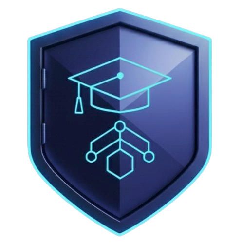

<div align="center">



# CredVault

### A blockchain-based platform for trusted identities, digital assets, and verifiable credentials

CredVault is a Smart India Hackathon project that uses decentralized identity,
role-based access control, blockchain asset records, encrypted document storage,
and public verification to create a transparent and tamper-evident digital trust
layer for institutions and their users.

[](https://credencevault.vercel.app/)
[](https://sepolia.etherscan.io)
[](LICENSE)

**[Open the live demo](https://credencevault.vercel.app/)** · **[Watch the SIH demo video](https://youtu.be/AMMgb_5i0ac)** · **[Open the public verifier](https://credencevault.vercel.app/#/verify)** · **[Read the contract documentation](Backend-Contracts/README.md)**

</div>

---

## 1. Project overview

Institutions manage large amounts of sensitive information: identity records,
certificates, ownership records, assignments, and administrative activity. In a
traditional system, these records are usually held in isolated databases. That
creates several practical problems:

- Records can be changed without a transparent history.
- Verification often depends on the issuing institution remaining available.
- A verifier may have no simple way to distinguish an original document from a modified copy.
- Permissions are frequently managed by application logic instead of an independently verifiable authority.
- Sensitive document content must be protected while still allowing authenticity to be checked.

CredVault addresses these problems by placing authoritative state transitions and
verification data on Ethereum while keeping sensitive metadata encrypted off-chain.
The platform is designed around a simple principle:

> Publicly verify what must be trusted; protect what must remain private.

The current implementation contains two connected capability areas:

1. **SIH Platform:** decentralized identities, on-chain roles, digital assets, credential-to-asset linking, and audit history.
2. **Credential verification:** document hashing, institution-issued credentials, holder consent, encrypted metadata, QR/share verification, and revocation checks.

The live deployment uses the **Ethereum Sepolia testnet**. It is a working prototype
and demonstration system; it is not presented as a production or legally equivalent
government registry.

## 2. Core capabilities

### Decentralized identity

The `IdentityRegistry` maps a Decentralized Identifier (DID) to one or more wallet
addresses and records the identity lifecycle on-chain. An identity can be created,
verified, suspended, reinstated, or revoked by authorized platform operators.

### On-chain roles and permissions

The `RolesAndPermissions` contract provides blockchain-enforced authorization for:

- Platform administrators
- Managers who operate assets and identities
- Auditors with read-only oversight access
- Regular users connected to their registered identity

The application does not decide a user’s privileged role from frontend state. It
resolves the connected wallet against the deployed contracts and routes the user to
the workspace allowed by the chain.

### Digital asset lifecycle

Managers can mint assets, assign them to users, transfer ownership, update metadata,
and inspect asset history. Each asset is represented by an on-chain token record with
an owner, assignee, status, optional DID association, metadata URI, and event history.

### Verifiable credentials

Institutions can issue credentials bound to a real document. The document is hashed in
the browser using `keccak256`; the file itself is not uploaded as part of hashing. A
credential can be accepted or rejected by its holder and can later be revoked or
reinstated by the issuing institution according to the contract rules.

### Privacy-preserving metadata

Credential metadata is encrypted with AES-256-GCM before being sent to IPFS. The
encryption key is not written to the blockchain or stored in IPFS. Share links and QR
payloads carry the key in the URL fragment, which is not sent to normal server logs.

### Public verification

Anyone can use the verifier without an administrative account. A verifier may paste a
share payload, scan a QR code, or enter the required values manually. The application
checks the blockchain record, credential status, expiry, issuer information, and
document hash before presenting the result.

### Auditable administration

The administrator workspace supports role assignment, permission configuration,
identity administration, system pause/unpause, and audit-log inspection. The auditor
workspace provides read-only views of identities, assets, ownership, transfers, and
blockchain activity.

## 3. How the system works

```text
                       ┌─────────────────────────────┐
                       │        CredVault frontend    │
                       │ React · TypeScript · Vite    │
                       └──────────────┬──────────────┘
                                      │ MetaMask / ethers v6
                                      ▼
┌─────────────────┐       ┌─────────────────────────────┐
│ Connected wallet│──────▶│ Ethereum Sepolia testnet    │
└─────────────────┘       │                             │
                          │ Roles & Permissions          │
                          │ Identity Registry            │
                          │ Asset NFT                    │
                          │ Credential Vault              │
                          │ Credential–Asset Bridge      │
                          │ Audit Log                    │
                          └──────────────┬──────────────┘
                                         │ encrypted metadata URI
                                         ▼
                          ┌─────────────────────────────┐
                          │ IPFS through serverless      │
                          │ pinning proxy                │
                          └─────────────────────────────┘
```

### Credential verification flow

```text
Institution selects document
          │
          ├── keccak256(document bytes) ──▶ documentHash on-chain
          │
          ├── encrypt metadata with AES-256-GCM
          │                              │
          │                              └──▶ IPFS CID / metadata URI
          │
          └── issue credential to holder as Pending

Holder accepts credential ──▶ Active record

Verifier reads chain + IPFS ──▶ decrypts metadata ──▶ checks hash, status, and expiry
```

Verification combines independent checks:

1. The credential record exists and its status is valid.
2. The supplied document matches the stored `documentHash`.
3. The encrypted payload can only be read with the key shared by the holder or issuer.

## 4. Role-based workspaces

| Role | Workspace responsibilities |
| --- | --- |
| **Platform Admin** | Manage managers and auditors, configure permissions, create and administer identities, pause or unpause the system, and inspect audit activity. |
| **Manager** | Mint assets, assign assets, transfer ownership, update metadata, link assets to credentials, and review on-chain asset history. |
| **Auditor** | Read-only access to identities, assets, ownership, transfers, credential-related activity, and audit entries. |
| **User** | View personal identity, linked wallets, owned or assigned assets, certificates, document status, and verification links. |
| **Public verifier** | Verify an asset or document without a privileged account or institution-side approval. |

Role resolution follows the connected wallet → identity → role path. Manual role
selection is not used for privileged access.

## 5. Smart-contract architecture

The backend is implemented in Solidity and deployed as six cooperating contracts:

| Contract | Responsibility |
| --- | --- |
| `RolesAndPermissions` | Role membership, permission matrix, administrative controls, and system pause state. |
| `IdentityRegistry` | DID records, wallet bindings, identity status, organization data, and identity lifecycle events. |
| `AssetNFT` | Digital asset minting, ownership, assignment, transfers, metadata, and asset status. |
| `CredentialVault` | Credential issuance, holder acceptance or rejection, expiry, revocation, reinstatement, and issuer registry. |
| `CredentialAssetBridge` | Links credential records and digital assets for connected verification workflows. |
| `AuditLog` | Structured, category-based audit entries for important platform actions. |

All state-changing operations are signed by a wallet and recorded as blockchain
transactions. The frontend reads historical events in chunks and uses RPC failover
for more reliable Sepolia reads.

## 6. Security and privacy design

- **Document integrity:** `keccak256` is calculated over the actual document bytes.
- **Encrypted metadata:** AES-256-GCM protects credential metadata before IPFS pinning.
- **Key derivation:** Web Crypto APIs provide HKDF and PBKDF2 support without adding a cryptographic dependency.
- **Holder consent:** credentials begin in `Pending` status and require holder action before activation.
- **Issuer accountability:** issuer identity, credential status changes, and administrative actions are attributable on-chain.
- **Role enforcement:** privileged operations are checked by Solidity contracts, not only by UI visibility.
- **Key backup:** holder keys can be exported in a passphrase-protected backup using PBKDF2.
- **Share-link privacy:** the decryption key is carried in the URL fragment, which browsers do not transmit in HTTP requests.
- **Read-only auditing:** auditor access is designed for inspection without state-changing permissions.

### Important limitations

CredVault is deliberately transparent about its current boundaries:

- Sepolia is a test network and does not provide legal validity.
- IPFS content remains available only while the relevant content is pinned or otherwise hosted by a gateway.
- A lost wallet or lost key backup can make a holder’s credential data inaccessible.
- The issuer can re-derive keys for credentials it issued; this is a recoverability trade-off in the current prototype.
- The issuer registry still requires responsible administrative governance.
- A QR code or share link gives its recipient access to the information represented by that key; sharing is therefore a consent decision by the holder.

The detailed contract threat model and credential lifecycle documentation are available
in [`Backend-Contracts/README.md`](Backend-Contracts/README.md).

## 7. Technology stack

| Layer | Technologies |
| --- | --- |
| Frontend | React 18, TypeScript, Vite, React Router, TanStack Query |
| UI | Tailwind CSS, Radix UI primitives, Lucide icons, responsive layouts, light/dark theme support |
| Blockchain | Ethereum Sepolia, Solidity 0.8.x, OpenZeppelin Contracts v5, Foundry |
| Web3 integration | ethers.js v6, MetaMask / EIP-1193 wallet provider |
| Cryptography | Browser Web Crypto API, AES-256-GCM, HKDF-SHA-256, PBKDF2 |
| Decentralized storage | IPFS through a serverless Pinata pinning proxy with gateway fallback |
| Hosting | Vercel static frontend and edge/serverless pinning endpoint |
| Testing | Vitest, Foundry unit tests, fuzz tests, invariant tests, TypeScript checks, ESLint |

## 8. Repository structure

```text
CredVault/
├── Backend-Contracts/
│   ├── src/                    # Solidity platform contracts
│   ├── test/                   # unit, fuzz, and invariant tests
│   └── script/                 # deployment scripts
├── api/pin.ts                  # server-side IPFS pinning proxy
├── src/
│   ├── pages/                  # public, credential, and SIH workspaces
│   │   └── sih/                # admin, manager, auditor, and user dashboards
│   ├── components/             # reusable UI, verification, issuance, and data components
│   ├── hooks/                  # wallet, SIH context, chain, and UI hooks
│   └── lib/                    # contracts, crypto, issuance, hashing, IPFS, and domain logic
├── docs/                       # testing walkthrough and screenshots
├── scripts/                    # ABI generation utilities
├── .env.example                # deployment and frontend configuration template
└── README.md
```

## 9. Run the project locally

### Prerequisites

- Node.js 20.19 or newer
- npm
- Foundry, if compiling or testing the Solidity contracts
- MetaMask or another EIP-1193 Ethereum wallet for transaction flows
- Sepolia ETH for signed testnet transactions

### Frontend setup

```bash
git clone https://github.com/rkhooda/CredVault.git
cd CredVault
npm install
npm run dev
```

The repository includes Sepolia contract defaults for the current demonstration
deployment. Copy `.env.example` to `.env.local` when using another deployment or
custom RPC/pinning endpoint. Never expose a private key through a `VITE_` variable.

### Available application routes

| Route | Purpose |
| --- | --- |
| `/` | Project landing page and platform overview |
| `/sih-portal` | Wallet connection and on-chain SIH role resolution |
| `/admin` | Administrator workspace |
| `/manager` | Asset manager workspace |
| `/auditor` | Read-only audit and verification workspace |
| `/user` | User identity, assets, and certificates workspace |
| `/verify` | Public asset and document verifier |
| `/institution-portal` | Credential issuer flow |
| `/student-portal` | Credential holder flow |

## 10. Development and verification commands

```bash
# Frontend
npm run dev
npm run build
npm run typecheck
npm run lint
npm test

# Smart contracts
npm run contract:build
npm run contract:test
npm run contract:coverage
npm run contract:abi
```

To deploy the complete SIH contract suite to Sepolia, configure the deployment
variables from `.env.example` and run:

```bash
npm run contract:deploy
```

The deployment script creates the contracts in dependency order:

`RolesAndPermissions → IdentityRegistry → AssetNFT → CredentialVault → CredentialAssetBridge → AuditLog`

After deployment, place the six printed addresses in the frontend environment, run
`npm run contract:abi`, build the frontend, and complete a smoke test for identity,
roles, assets, credentials, verification, and audit logs.

## 11. Current Sepolia deployment

The frontend is configured with the following verified demonstration deployment:

| Contract | Address |
| --- | --- |
| Roles and Permissions | [`0xe0dc09c754ff95a48c960e9280650717284cd2e8`](https://sepolia.etherscan.io/address/0xe0dc09c754ff95a48c960e9280650717284cd2e8) |
| Identity Registry | [`0x77f634771ca157e31aea0c0a8cd19a7cc0b2a691`](https://sepolia.etherscan.io/address/0x77f634771ca157e31aea0c0a8cd19a7cc0b2a691) |
| Asset NFT | [`0x098e6d74ad964bfb098673673f1327670117dbfa`](https://sepolia.etherscan.io/address/0x098e6d74ad964bfb098673673f1327670117dbfa) |
| Credential Vault | [`0x68633ecea55e90f48922290dc9610cb6d32aabe5`](https://sepolia.etherscan.io/address/0x68633ecea55e90f48922290dc9610cb6d32aabe5) |
| Credential–Asset Bridge | [`0x68faf69679e628d6050826466dc7ad67a0bcdc07`](https://sepolia.etherscan.io/address/0x68faf69679e628d6050826466dc7ad67a0bcdc07) |
| Audit Log | [`0xd7df9fb0a541b0e9e6ad2c6d4bd0800754046873`](https://sepolia.etherscan.io/address/0xd7df9fb0a541b0e9e6ad2c6d4bd0800754046873) |

These addresses are intended for demonstration and evaluation. A fresh deployment
should be used for production or any environment requiring independent governance.

## 12. SIH demonstration

### Project walkthrough

This short demo explains the problem CredVault addresses and walks through the
main Smart India Hackathon flow: wallet-based identity, role-based workspaces,
digital asset management, credential issuance, encrypted metadata, public
verification, and auditability.

<div align="center">

<a href="https://youtu.be/AMMgb_5i0ac">
  
</a>

<br />

<strong><a href="https://youtu.be/AMMgb_5i0ac">▶ Watch the CredVault SIH project demo on YouTube</a></strong>

</div>

The video is intended as a quick product overview for SIH evaluators and can be
viewed alongside the [live demo](https://credencevault.vercel.app/) and the
[public verifier](https://credencevault.vercel.app/#/verify).

### Supporting demonstration material

- [End-to-end testing walkthrough](docs/CredVault-Testing-Walkthrough.pdf)
- [Testing walkthrough source](docs/Testing-Walkthrough.html)
- [Verification screen](docs/screenshots/verify.png)
- [Proof panel](docs/screenshots/proof.png)
- [Landing page](docs/screenshots/landing.png)
- [Dark-mode platform model](docs/screenshots/model-dark.png)

## 13. Project status

CredVault currently provides a functional prototype covering the primary SIH
demonstration flow: wallet connection, identity and role resolution, role-based
workspaces, on-chain asset management, credential issuance and consent, encrypted
metadata, public verification, and audit inspection.

Future production work would include formal institutional governance, stronger key
recovery and rotation, persistent IPFS pinning guarantees, privacy-preserving identity
attestations, multi-network deployment, and independent security audits.

## Licence

MIT — see [LICENSE](LICENSE).

<div align="center"><sub>Built for Smart India Hackathon · CredVault</sub></div>
